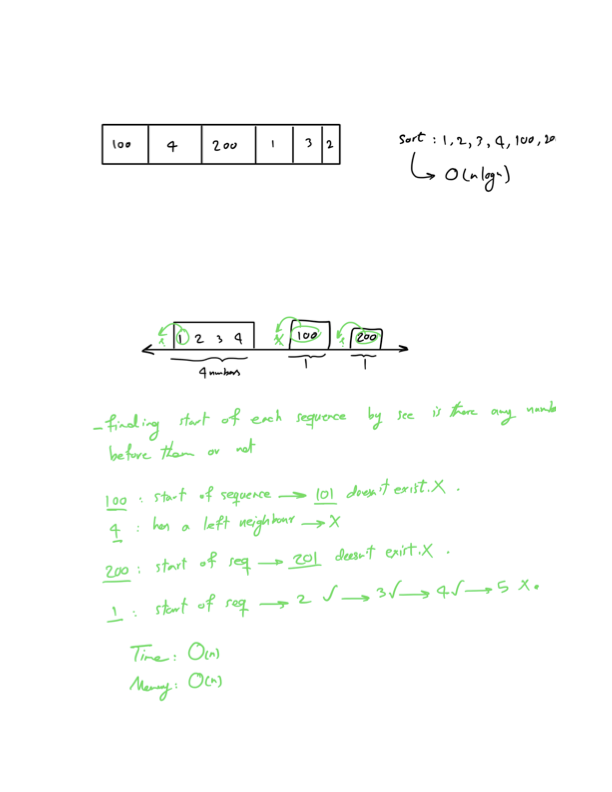

# Problem

Given an array of integers ‍‍`nums‍`, return the length of the longest consecutive sequence of elements that can be formed.

A consecutive sequence is a sequence of elements in which each element is exactly 1 greater than the previous element. The elements do not have to be consecutive in the original array.

# Description

# Refs

- [longest consecutive sequence](https://neetcode.io/problems/longest-consecutive-sequence/question)
