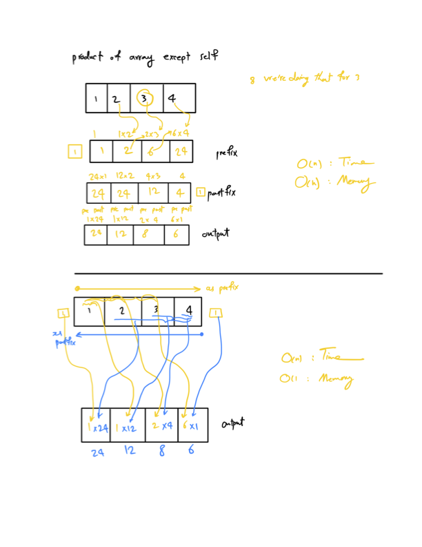

# Problem

Given an integer array `nums`, return an array `output` where `output[i]` is the product of all the elements of `nums` except `nums[i]`.

# Execptions

- O(n)
- without division operation

# Description

# Source

[products of array discluding self](https://neetcode.io/problems/products-of-array-discluding-self/question)
