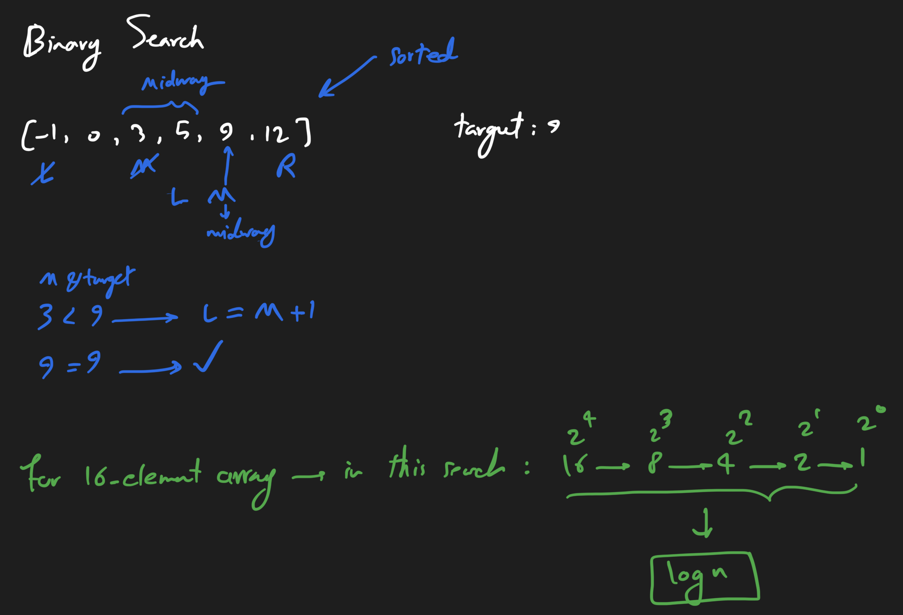

# Problem

You are given an array of distinct integers `nums`, sorted in ascending order, and an integer `target`. Implement a function to search for `target` within `nums`. If it exists, then return its index, otherwise, return `-1`.

# Complexity

- time: O(logn)

# Description

# Refs

- [binary-search](https://neetcode.io/problems/binary-search/question)
